# Bathymetry Data Processing How-To Documentation
Companion to the Bathymetry Processing Python Script  
Produced by: Chris Hay, Scientific Data Manager, IISD-ELA  
For: International Institute for Sustainable Development Experimental Lakes Area  
Last modified: 2026-01-13  

## Contents

- [Setting Up – Before the Script](#setting-up--before-the-script)
  - [Prep the Input CSVs](#prep-the-input-csvs)
  - [ArcGIS Pro Project](#arcgis-pro-project)
  - [How to run the script](#how-to-run-the-script)
- [Part 1: Variables](#part-1-variables)
- [Part 2: Raster DEM](#part-2-raster-dem)
  - [2.1 Improve the lake polygon and transect points](#21-improve-the-lake-polygon-and-transect-points)
  - [2.2 Metadata documentation](#22-metadata-documentation)
- [Part 3: Contour Lines](#part-3-contour-lines)
- [Part 4: Tabular](#part-4-tabular)
- [Part 5: Maps](#part-5-maps)
  - [5.1 – Colour Map](#51--colour-map)
  - [5.2 – Black and White Map](#52--black-and-white-map)
  - [5.3 – Colour Layout](#53--colour-layout)
  - [5.4 – Black and White Layout](#54--black-and-white-layout)
  - [5.5 – Export the Maps](#55--export-the-maps)

# Setting Up – Before the Script

Bathymetric data processing may be done by the IISD-ELA Scientific Data Officer, other permanent staff, or contracted staff. Documentation has been written with this in mind, and that of a general audience external to IISD-ELA to share the methods used.

## Prep the Input CSVs

For IISD-ELA staff or assistants, if bathymetry surveys have been conducted and you have been directed to do this processing, you should find a collection of raw csv files in the dropbox folder here:

SharePoint \> Global Shared Files \> ELA \Bathymetry\Data\Transects\Tabular\Lee dropbox

Check to confirm the raw csv files follow the formatting conventions described below.

Input transect CSV files must be named as monitoring location, underscore, monitoring sublocation, e.g., “106_LA.csv”. Two digit or four digit lakes should be typed as they are – e.g., 93_LA not 093_LA. The CSV files must be formatted as having three columns, named “y”, “x”, and “z”, where:
- y = Latitude in decimal degrees.
- x = Longitude in decimal degrees.
- z = Depth in metres. All or most of the values should be negative (there may be a few outliers, which will be removed later in the script). This is what the script will expect.
- 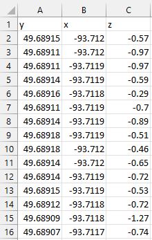

If the z values are positive, not negative, it is easy to fix in Excel:
- Populate a column beside the z values with -1 (type -1 in the first one and double click bottom right corner of cell to fill in the rest)
- Select all the -1s and Copy (Ctrl + C)
- Select the cell for the first z value and right click \> Paste Special… \> Paste Special… \> Multiply \> OK
- Delete the -1 column
- Save (as csv)
- 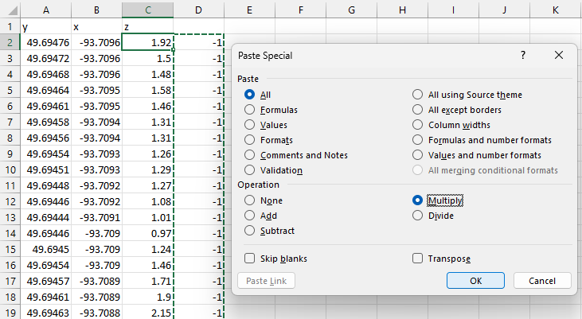

## ArcGIS Pro Project

*Option A. – IISD SharePoint connection available*

Create a shortcut that links the SharePoint Bathymetry folder onto the OneDrive or local PC of the person doing the processing. That way, work can be done locally and changes will sync to SharePoint.
- 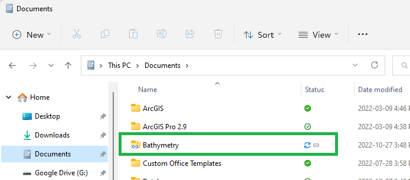

Under Bathymetry \> Workspaces, create a new folder with your name.

The person carrying out the processing should be logged into ArcGIS Pro and have access to the IISD ArcGIS Online organization. This is necessary to access the best lakes polygon GIS file currently available ("ELA_LakesALL20141030" on ArcGIS Online). If the person carrying out the processing does not have access to this, as a workaround someone from IISD-ELA who does have access should create a copy to send to them (as a shapefile or feature class in a geodatabase), and the person carrying out the processing will need to alter the script to refer to their local copy instead of pulling from ArcGIS Online.

Set up your workspace:
- In the “YourName” workspace folder, do the following:
  - Create a subfolder named “Inputs” with the following inside:
    - Create a subfolder named “InputTransects”
      - Paste all input CSV files into this folder (the input CSVs are from Bathymetry \> Data \> Transects \> Tabular \> Lee dropbox)
    - Create a subfolder named “TemplateTables”
      - Paste copies of the three template tables (from Bathymetry\Workspaces\TransectsProcessingPipeline\Inputs\TemplateTables)
        - bathy_db_data_table_template.csv
        - bathy_db_meta_table_template.csv
        - bathy_summary_stats_table_template.csv

Start new project on ArcGIS Pro:
- Open ArcGIS Pro (log in to your account, if needed)
- Under “New Project” choose “Map”
- In the popup:
  - Name: Enter the name of the workspace folder you created earlier
  - Location: Paste the folder path location of your workspace
  - Uncheck “Create a new folder for this project”
  - 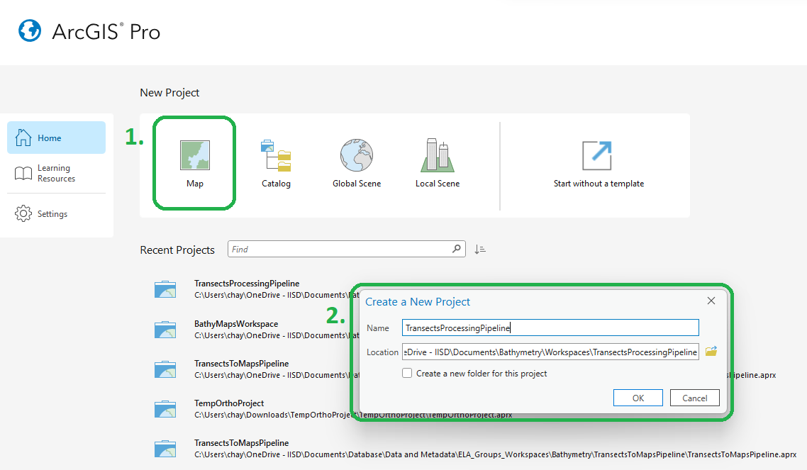

## How to run the script

Locate the python script file (“PythonScript_BathymetryProcessing_IISD-ELA.py”) or access the script from GitHub. It is easiest to download or copy the script locally to work within, and best practice is to save a copy of the script for each lake that is processed. Avoid modifying the original script file or GitHub repository (unless if you are making improvements that would apply to all future uses). Ideally the script copy will be open in a second monitor to the side, for easy access to editing variables and copy lines of script (to paste into the ArcGIS Python window and execute).

The script must be run in a live Python window within an ArcGIS Pro Project. This is required so certain lines of script will work correctly. For example:

*aprx = arcpy.mp.ArcGISProject('CURRENT')*

Sometimes ArcGIS Python scripts can be run outside of a project in a separate python window, but this is not the case for this script.

Open the Python console window in your ArcGIS Pro Project if it is not open already (View \> Python window (under the “Windows” section of the tab).

- 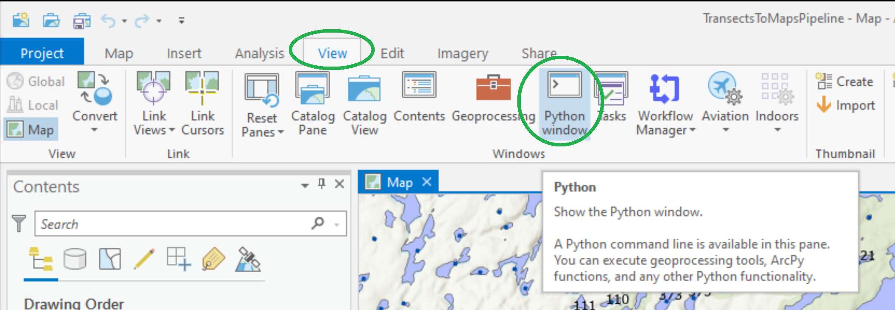

In later steps, you will run the script line by line or in small chunks by copying and pasting it into the Python window. It is recommended to go line by line or in small chunks to make sure any errors that pop up are easy to identify and resolve. After pasting in a line or chunk of script, use Ctrl + Enter to execute it. Do not run the script yet.

- 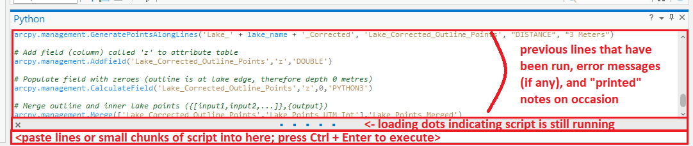

# Part 1: Variables

Essentially this first part of the script involves defining variables. Follow instructions in the script comments (comment lines are always preceded with a number sign “#”) and edit the script directly (in the working copy), as required.

- Some variables are short and obvious (e.g., lake_num)
- Some variables are longer, such as file or folder paths
  - Each script user will need to change directory paths so the script will run properly on their computer.
- The lakes you will be processing should be evident from preparing (reviewing) the input csvs in the previous setup steps. The metadata for the lakes should be in the metadata Excel spreadsheet noted in the script comments in this section.

When you finish part 1 of the script, continue into part 2 of the script until it says STOP (at which point you should return to the documentation here).

# Part 2: Raster DEM

## 2.1 Improve the lake polygon and transect points

**Add World Imagery**
- The World Imagery will be used to correct the lake shape from the inaccurate reference.
- Add the satellite basemap by clicking Map \> Basemap \> Imagery.
  - 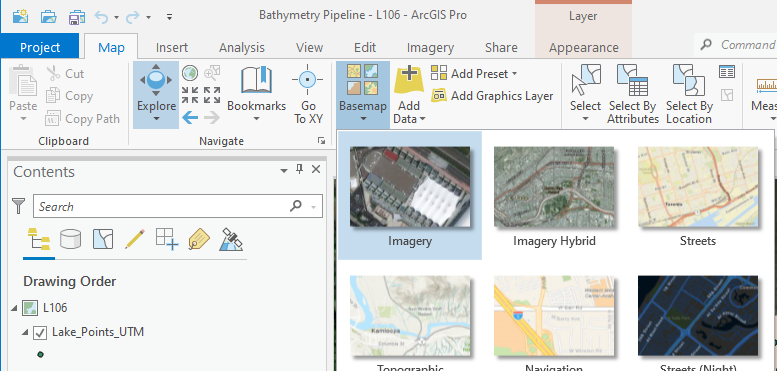

**Get the lake polygon ready to work with**
- Right click “Lake\_###\_AA_Polygon” and click Selection \> Make this the only selectable layer.
  - 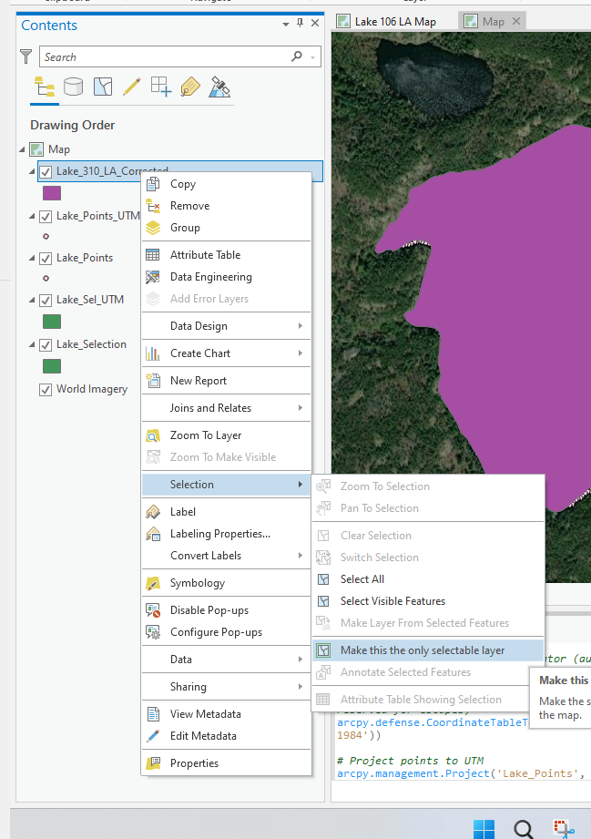
- Change symbology so the layer easier to work with
  - Once again right click “Lake\_###\_AA_Polygon” and click Symbology – a symbology window will appear on the right panel.
  - On the panel there’s a symbology symbol box. Click the box to change it.
  - Change the symbol to the 2pt (thicker) black outline template. Then click the Properties tab and change the symbol color to something easy to see (e.g., bright yellow)
  - Click “Apply”
  - Save
  - 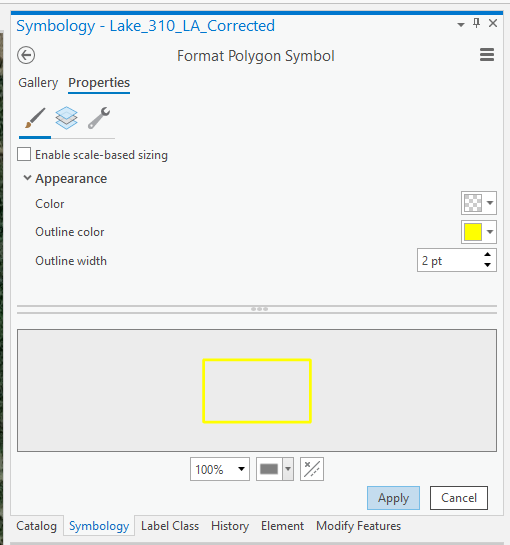
- Turn off visibility on all of the other layers except for three layers that should be visible:
  - Lake\_###\_AA_Polygon
  - Lake_Points_UTM
  - World Imagery
- Double check you are working with the right layer (“Lake\_###\_AA_Polygon”) and that it is the topmost layer.
- World Imagery should always be on the bottom, as a base map.
  - 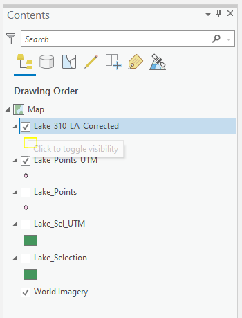

**Outliers – check for, and remove**
- Minimize “Lake\_###\_AA_Transect_Points” to avoid editing the wrong layer
  - 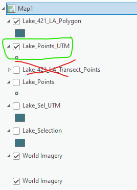
- Make the points layer (2nd from the top) the only selectable layer (right click \> Selection \> Make this the only selectable layer)
- Work within the transect points layer **“Lake_Points_UTM” (important: not “Lake\_###\_AA_Transect_Points”)**. The goal is to prepare the points for the next step in the script. The “Lake\_###\_AA_Transect_Points” layer was a final output exported to a final output geodatabase, that should stay as a raw representation of the survey points collected (equivalent with the raw tabular coordinates).
- Change the symbology to “Unclassed colours” and “Field: z”. Choose a colour gradient that is easy to see against the backdrop and makes any outliers clearly visible. Switching from one gradient to another may be useful to double check.
- Examine the map to identify potential outliers. For example, below some potential candidates are circled in orange. A degree of personal best judgement is involved. Outliers that are removed should be assumed to be errors in the sonar survey technology or methods. Avoid removing what may be natural peaks or valleys in the data. Zoom in enough to ensure only outlier points are removed.
  - 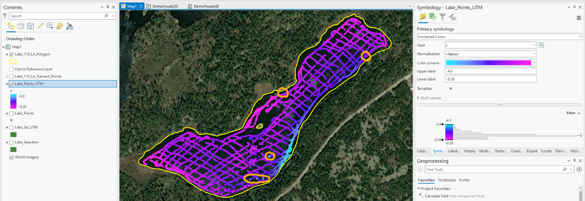
- Use “Edit Vertices” to select points and the DEL keyboard key to remove the outliers.
- Save edits and deselect all.

**Edit the lake polygon**
- To select the lake polygon, make it the only selectable layer (like we did for the points layer before), then go to the Edit tab then click the select tool.
  - 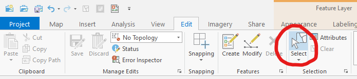
- On the map, drag a rectangle over any part of the lake polygon to select it. Right click the selected polygon and choose “Edit Vertices”.
  - 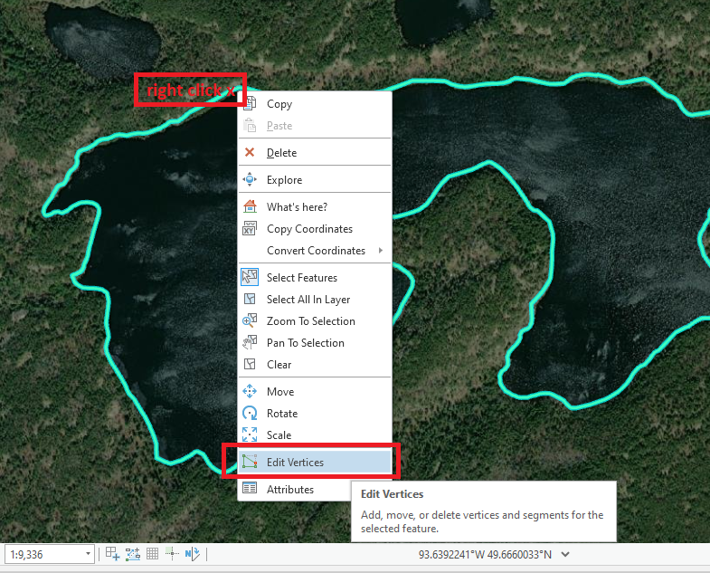
- Another way to get to the same point is, after having selected the polygon on the map, click “Edit Vertices” from the top ribbon menu, under Edit \> Edit Vertices (under “Tools” section of tab).
  - 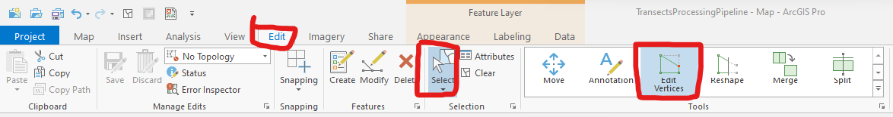
- Edit the vertexes to match the outline of the lake. Feel free to use other editing tools (e.g., “Reshape” with snapping turned on) instead, if preferred. Scroll down to the “Best practices and example” section in this document to see a visual example and for other important considerations while doing the editing, as well as the remaining points in this section.
- Be sure to regularly “Finish” (F2) and Save edits (Edit \> Save)!
  - 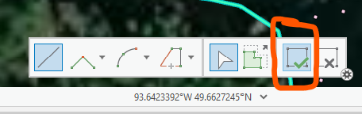
  - 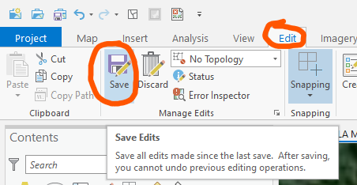
- Some lake polygons may be “multipart”, meaning there are isolated sections not continuous with the main lake outline. In most cases only the main lake part should be kept.
  - Probably the easiest way to remove these areas is to use the “Edit Vertices” tool. Choose the icon with the subtract symbol (delete vertices) and drag the mouse to trace around the vertices to delete. Then “Finish” (F2) and save edits.
  - 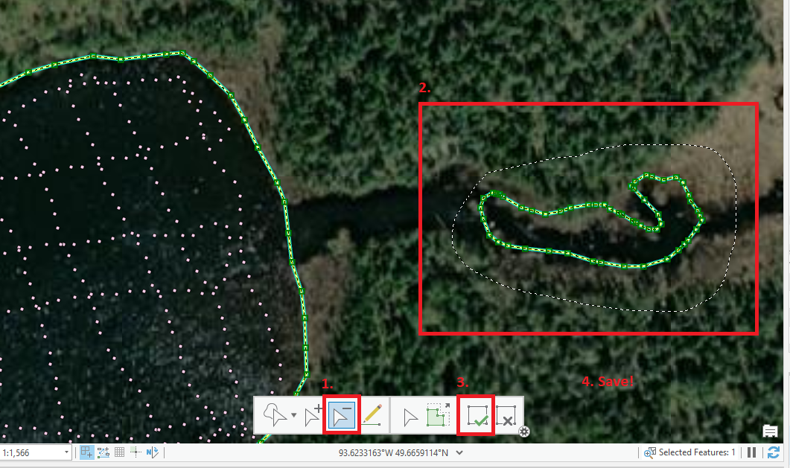
- Check if the corrected polygon includes all of the points
  - Note: Not ALL of the points must always be included (some may be out of bounds due to an error, or do not make sense in some other way). In the next steps of the script, the points outside of the lake outline will be omitted from further analysis.
  - To check how many points are inside vs out, use Select By Location.
    - Search “Select by Location” in the Geoprocessing panel to find the tool (or the GUI button can be found under the "Map" tab in the top ribbon)
    - Drag layers into and use the dropdowns to fill in the parameter boxes:
      - Input Features: Transect points layer (e.g., “Lake106LA_points_UTM”)
      - Relationship: Intersect
      - Selecting Features: Lake polygon outline layer (e.g., “Lake106_Corrected”)
      - 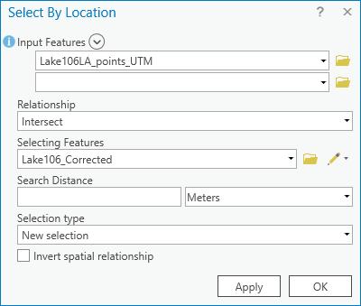
- Then open the transect points layer’s attribute table (right click the layer in the contents panel \> attribute table) and examine how many got selected.
  - 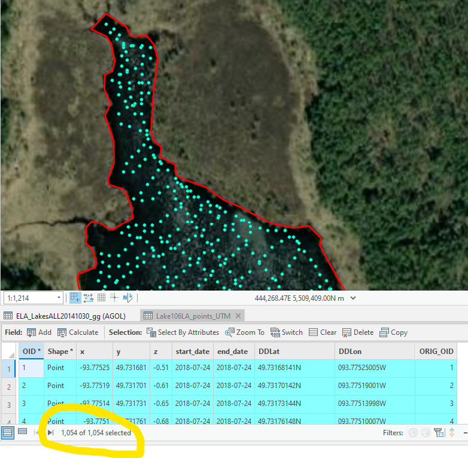
- Re-edit the lake polygon outline layer as needed (or leave it as-is if no action needed).
- Save

**Best practices and example**
- For consistency between lakes, follow these best practices:
  - Have vertices about every 5 to 30 metres (as needed)
    - Use the Map \> Measure tool to get an idea of how that distance looks
    - Note that later in the script, points will be generated along the outline every 3 metres
  - Work at a scale of about 1:1,000 to 1:500
  - Learn to recognize land features (e.g. tree foliage hanging over lake – which should be ignored, vegetated wetland areas of lake vs. open water)
  - Use the boat transect points to help guide the extent of the outline, but do not trace around outliers. Between the boat transect points, the lake polygon, and the imagery, all three layers have some degree of error.
  - Do not trace the outline in areas where the transect points were not collected, such as wider inlets or outlets, or wetlands (see example below).
- For an (approximate) good example, see the yellow line in this visual:
  - 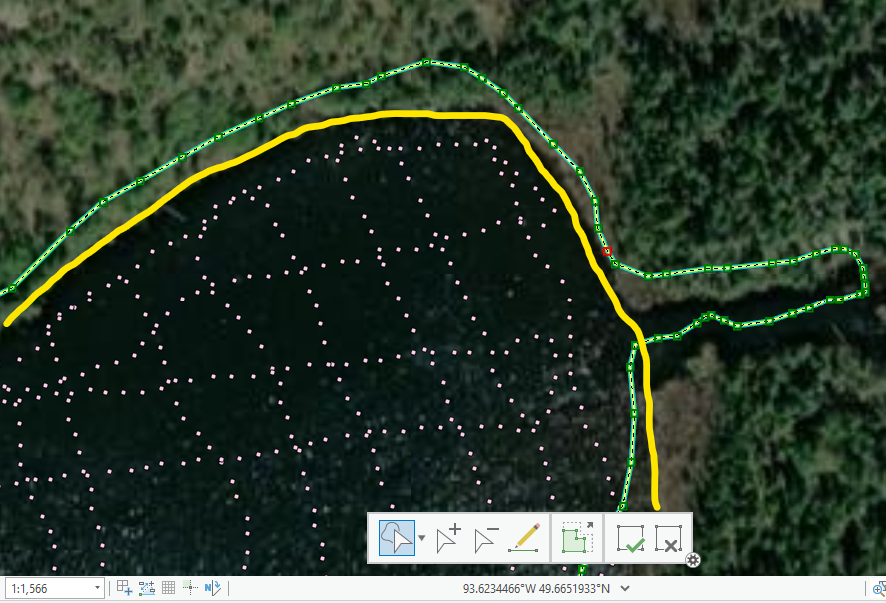
- When finished, save edits and clear the selection. Save the ArcGIS Pro project.

## 2.2 Metadata documentation

- Add the World Imagery *metadata* layer (which is different from the World Imagery basemap layer itself)
  - Add the metadata layer via Map \> dropdown for Add Data \> Data From Path
  - 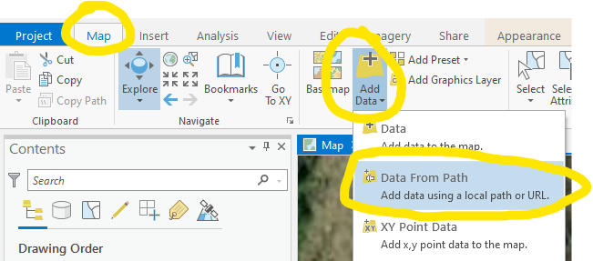
- Use this URL path: (copy and paste it)
  - `https://services.arcgisonline.com/ArcGIS/rest/services/World_Imagery/MapServer/0`
- Leave “Service type” as the default
- Click “Add”
  - 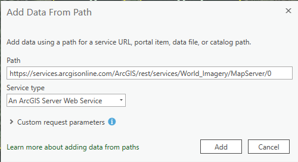
- The metadata layer will be added to the map (confusingly, it is also called “World Imagery”) – leave it there and “visible”, at least until done collecting the metadata
- 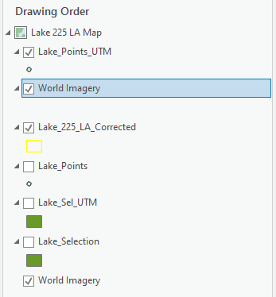
- Reference: this information is from an online esri help page:
  - <https://support.esri.com/en/technical-article/000018129>

- Get the metadata pop-up to show up
  - Use the “Explore” tool (Map \> Explore)
  - 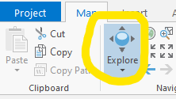
- Click on the map on the imagery on your lake (regular left click, not right click).
- 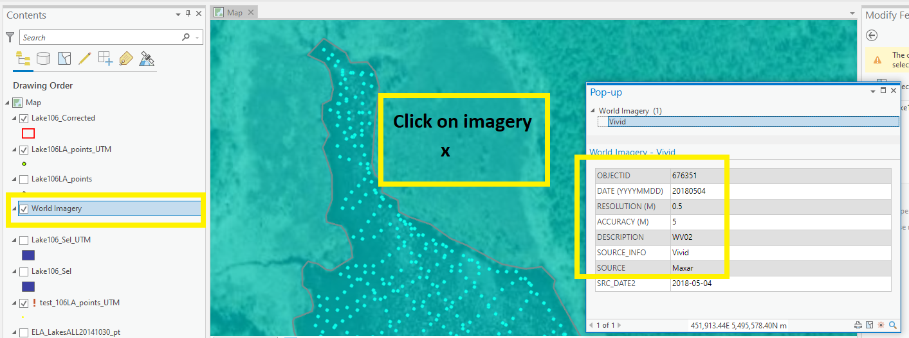
- If this isn’t working, ensure that the World Imagery metadata layer is selectable (right click \> Selection \> Make this the only selectable layer)

- Record the metadata (to justify the lake outline) in the separate “LakePolygonMetadataImagerySource.xlsx” spreadsheet file.
  - SharePoint \> ELA \> GIS\Data & Metadata\ELA Lakes\Polygons\Corrected\Metadata
    - “LakePolygonMetadataImagerySource.xlsx”
  - 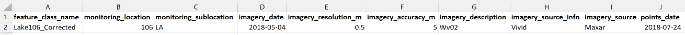

- Column information for the metadata spreadsheet:

  - feature_class_name = Name of the polygon feature class with corrected lake outline (stored in LakePolygonsCorrected.gdb)
  - monitoring_location = Lake number and sublocation (e.g. 310 LA)
  - transect_survey_start_date = Date the bathymetry transect points raw were collected in the field. You'll find this in the metadata Excel file used to fill in other parts of the processing pipeline script's metadata. aka "activity_start_date" or "survey start date" (ignore end date)
  - imagery_* = Metadata for the imagery used as a reference

# Part 3: Contour Lines

No additional comments or instruction needed – follow the script and read the comments in the script.

# Part 4: Tabular

The processing steps are done entirely in the script – follow the script and read the comments in the script. See the separate “information sheet” file for some additional explanation about tools used to derive interval and cumulative area and volume values for the tabular data.

The steps for Part 5 assume you have run parts 1-4 for each lake and then the FME Workbenches were ran to load those data into the IISD-ELA database’s collective bathymetry data and metadata tables. Those tables can then be exported for you to view as a tidy summaries of data for producing the map tables. An alternative is to run steps 1-5 for a lake before moving onto the next lake. In that case, you can find the values for the map tables by examining csv outputs from Part 4.

Parts 1-4 can be run for one lake after another within the same ArcGIS Pro project created at the start of your work. Creating a new ArcGIS Pro project for each lake is unnecessary. As noted in the Part 5 instructions, Part 5 should always be done in the specified “BathyMapsWorkspace” project (not the ArcGIS Pro project used for Parts 1-4).

# Part 5: Maps

Note that the map production process does not involve any scripting.

## 5.1 – Colour Map

**Create a new map**

- Open the ArcGIS Pro project “BathyMapsWorkspace”
  - Location: SharePoint \> ELA \> Bathymetry\Workspaces\BathyMapsWorkspace
  - Again, the notes here for “Part 0: Setting Up” apply… ideally you have a shortcut set up so this is easy, otherwise you will need to download the project folder, work locally, and then upload back to SharePoint overwriting the old version when you’re done (so SharePoint stays up to date)
  - Instead of working in the “TransectsProcessingPipeline” folder and project (or whichever ArcGIS Pro project file you were working in) for parts 1 to 4, you will be working in the established “BathyMapsWorkspace”.
  - Parts 1 to 4 it doesn’t really matter which project you were working in (the project was just a space to work in, where inputs and exports are all outside of the .aprx project file), but for this Part 5 it does matter (maps and layouts we create are saved within the .aprx project file itself). That’s why if you have to download the project, it is important you re-upload it to SharePoint when you are done.
- Insert a new map (Insert \> New Map \> New Map)
  - 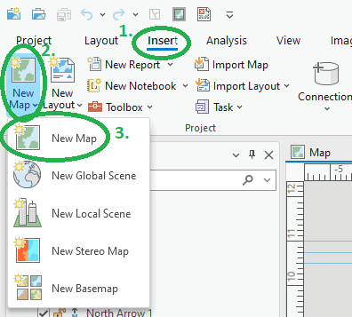
- Rename the map to **"106 LA - Bathymetry Map (Colour)"** (or whichever lake name you are working on, including the LA, and strictly in this format)
  - To do this, in the left “Contents” panel you can right click the map name, and choose “Properties”
  - Then under General \> Name, you can type in the new name
  - Press OK
  - 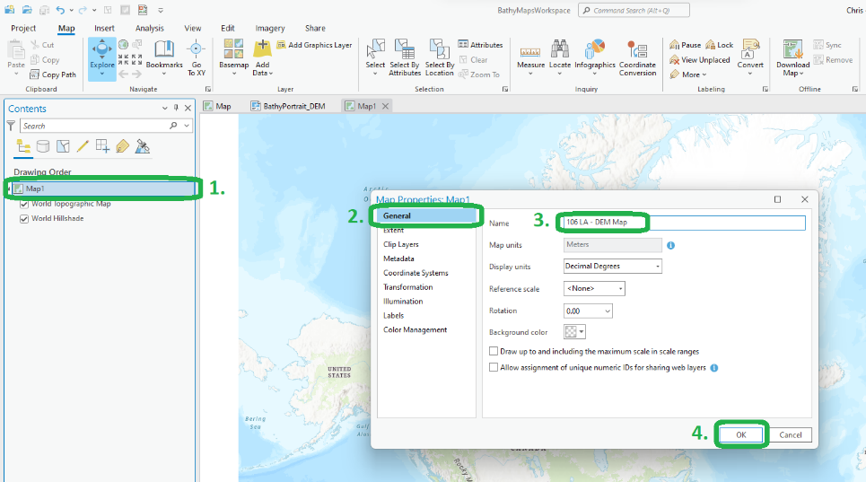

**Add layers: World Imagery, Contours, Lake Outline, Raster DEM**

- **Raster DEM**: Add the raster DEM
  - Found under Bathymetry -> Data -> DEMS (rasters) -> DEMsRasters.gdb as "Lake_XX_LA_Raster_DEM"

- **World Imagery**: Change the basemap to “World Imagery”
  - Map \> Basemap \> Imagery
  - This will automatically remove the default “World Topographic Map” and “World Hillshade” layers – great!
  - 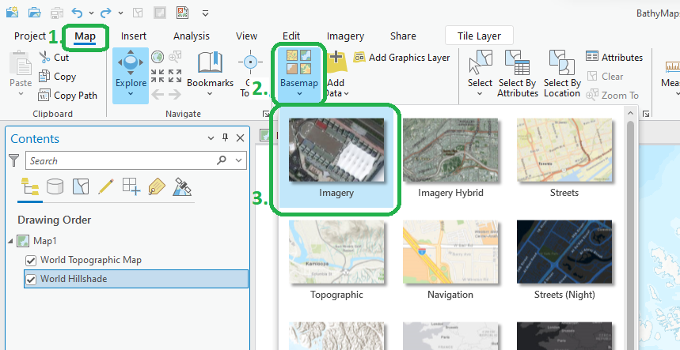

- **Contours**: Add contours and choose one
  - In the catalogue panel (right) navigate to the contour feature classes: Bathymetry \> Data \> Contours (geospatial line files) \> Contours.gdb \> there should be two feature classes for your lake in question
    - If you’re not connected to the Bathymetry SharePoint folder with a local shortcut, or don’t want to be, you can just download the “Contours.gdb” to your local machine and connect to it there (in your downloads folder or wherever you want to temporarily store it)
    - If the Bathymetry folder (or wherever you are connecting to the gdb) isn’t in the right Catalog panel, you can add a connection to the folder… in the right Catalog panel, right click “Folders” then click “Add Folder Connection”
      - 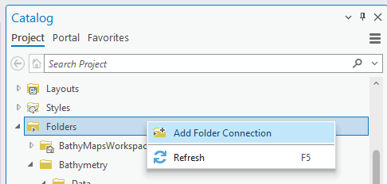
    - Navigate to the SharePoint Bathymetry folder (or wherever), click it once to select it (don’t double click to open it), then click OK
  - Select both (use ctrl or shift – or just do one at a time) and drag them onto the map
  - 
  - Use your best judgement and cartographic eye to choose which contour will be more meaningful on a map. You want to convey the lake’s bathymetric structure with enough detail, without the lines being too cluttered
  - In this case, the finer scale 0.25m contours are the better choice
    - 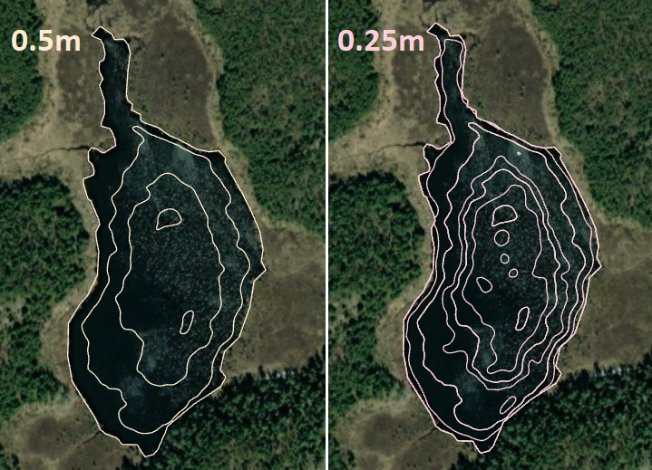
    - Remove the other contour layer from the map.
  - Do not worry about the contour symbology (line thickness and colour) – this will be corrected later

- **Outline**: add the lake outline
  - Just like you added contours earlier, you will need to add the lake outline (again, either you are connected to SharePoint with a shortcut set up in your local drive, or you need to download the geodatabase to your local machine and connect to it that way)
  - It is found in SharePoint \> ELA \> GIS \> Data & Metadata \> ELA Lakes \> Polygons \> Corrected \> LakePolygonsCorrected.gdb \> Lake_106_LA_Corrected
    - 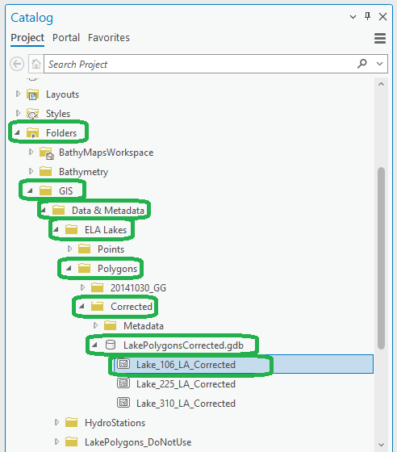

- **LighteningBox**: this layer is added for aesthetic purposes to lighten (brighten) the satellite imagery base map, to improve map readability and printing quality
  - The feature class is stored in the BathyMapsWorkspace.gdb (within the BathyMapsWorkspace project)
    - 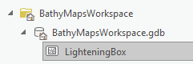

- **Order the layers**
  - Drag the layers in the contents panel so they are in the right order:
    - Lake 106 LA Corrected (the outline)
    - Contours
    - LighteningBox
    - Raster DEM
    - Imagery

- **Check**: The map should look something like this – again, do not worry about symbology yet
  - 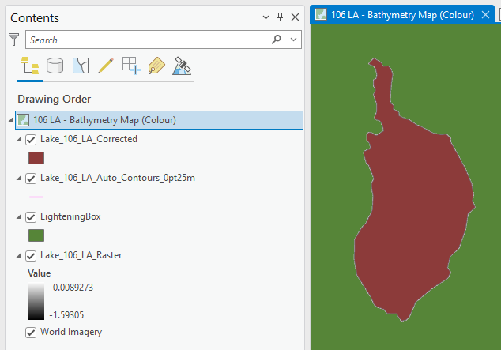

- **Save (Ctrl + S)**

**Apply standard symbology to layers**

- Add all symbology template layers to the map. Layer linkages may have broken and the layers may not show on the map but it should not matter. The symbology template layers are only needed for their symbology content.
  - The layer files are here: SharePoint \> ELA \> Bathymetry\Workspaces\BathyMapsWorkspace\SymbologyLayers
  - Use Shift or Ctrl to select all the layers and drag them into the contents pane – ideally above or below all the other layers, to avoid confusion
  - 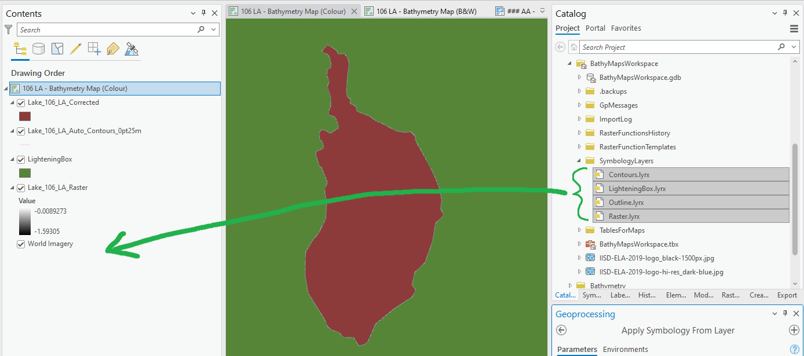
- Use the “Apply Symbology From Layer” tool
  - Search “Symbology” in the Geoprocessing panel
    - If the Geoprocessing panel is not already there, it can be added via: View \> Geoprocessing (under “Windows” section)
      - 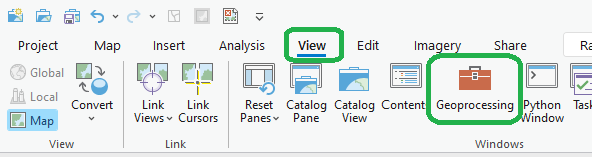
  - Open the “Apply Symbology From Layer” tool
  - Drag the input and symbology layers from the contents pane into the tool textboxes, accept defaults for the other parameters, and Run the tool.
    - The “input” is the actual lake layer in question that you want to correct the symbology for
    - The “symbology” layer is the symbology template layer that contains the desired symbology information
    - 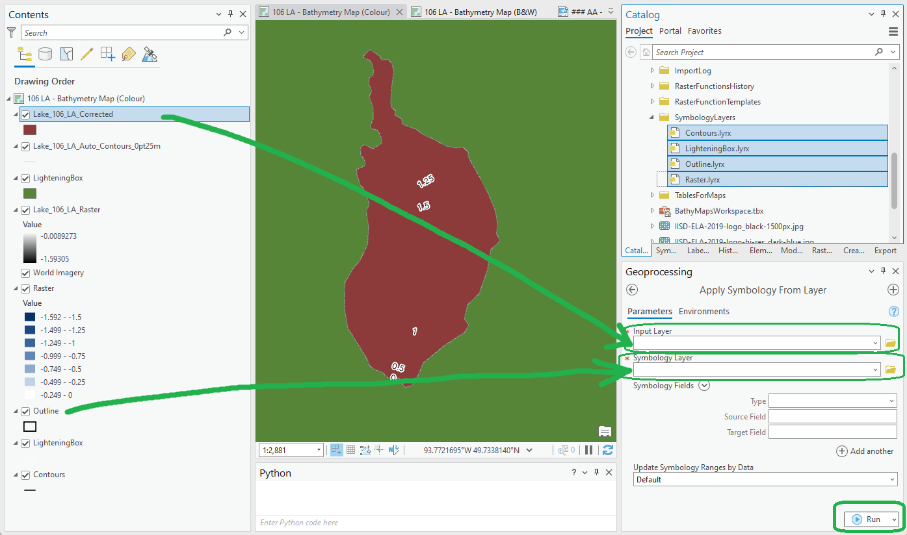
  - Continue this process for all of the other layers (except World Imagery and the Raster DEM)
  - Connect the Raster DEM symbology layer to the actual Raster DEM
    - Click the red exclamation point next to the Raster DEM layer
      - 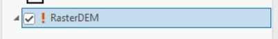
    - OR if there is no red exclamation point, instead do as follows:
      - Right click Raster DEM symbology layer \> Properties
      - 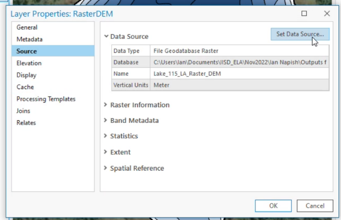
    - Navigate to the Raster DEM for the lake in question
      - SharePoint \> ELA \> Bathymetry \> Data \> DEMs (rasters) \> DEMsRasters.gdb \> Lake_106_LA_Raster_DEM
  - Remove the symbology template layers from the contents panel (select them all and right click \> remove) (Note: screenshot shows the Raster DEM symbology layer being removed, but instructions were updated and that should be kept now – assuming it is connected to the Raster DEM for the lake in question, as per above steps)
    - 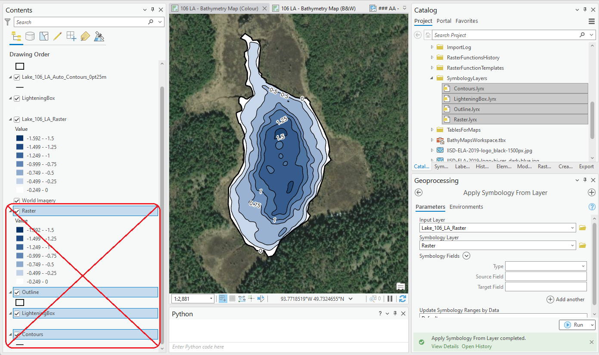
  - Adjust raster DEM symbology
    - The raster DEM layer requires some additional manual adjustments for the gradient to be stretched across the depth range of the specific lake in question (which will vary from the template)
    - In the contents panel, right click the raster DEM layer \> Symbology
    - Change the interval size to correspond with the contour interval (for most lakes this will be 1)
      - The template is 0.25 for the interval. If your current map uses the same interval, enter something else (e.g., 0.5), press Enter, wait for the map and classes to update, then change back to 0.25. The symbology just needs a prompt to refresh to fit the current lake raster.
    - 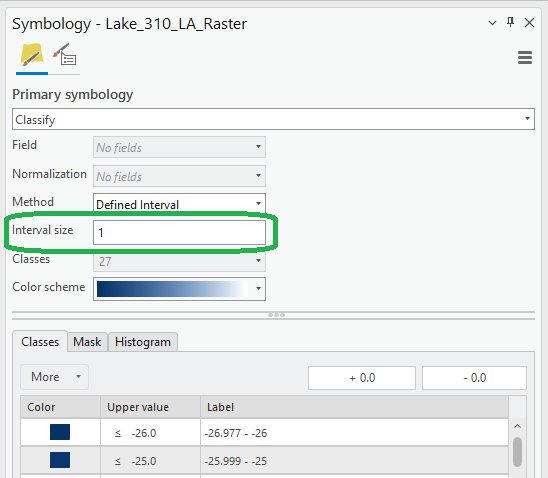
    - The before and after may look something like this:
      - Before
        - 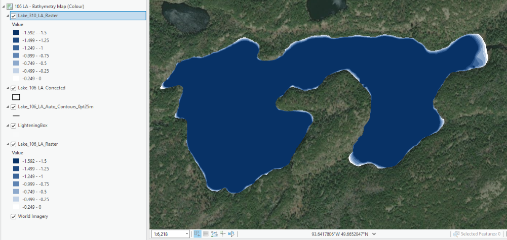
      - After
        - 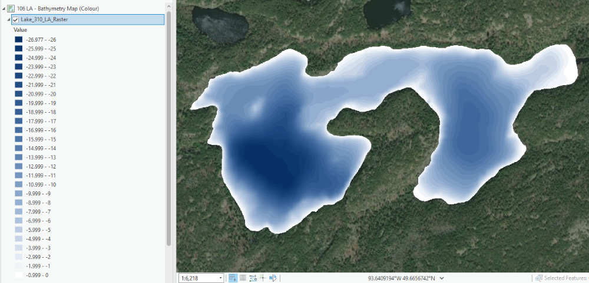
  - The map is complete and should look something like this:
    - 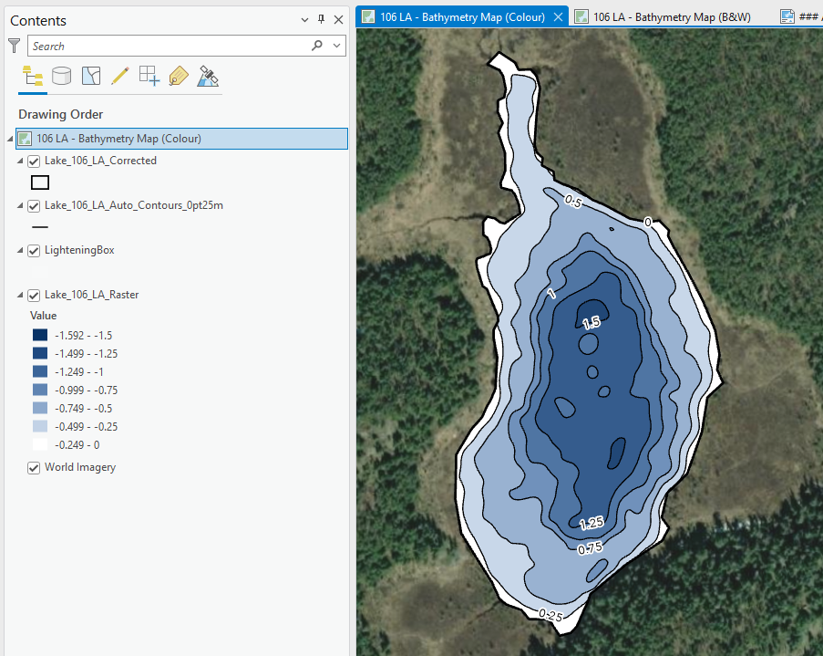
  - Save

  - Note: there is an option later to manually improve the contour layers, but that should only be undertaken at that later stage in the process.

## 5.2 – Black and White Map

The Black and White map is essentially done after copying the outline and contour layers from the previous map.

**Create a new map**
- Insert a new map (Insert \> New Map \> New Map)
  - 
- Rename the map to **"106 LA - Bathymetry Map (B&W)"** (or whichever lake name you are working on, including the LA, and strictly in this format)
  - To do this, in the left “Contents” panel you can right click the map name, and choose “Properties”
  - Then under General \> Name, you can type in the new name
  - Press OK
  - 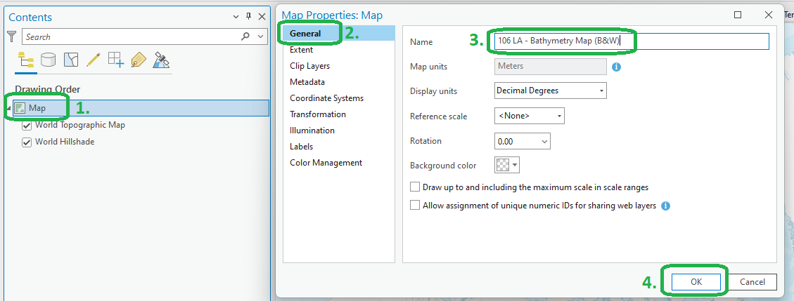

**Remove basemap and add contours and outline from other map**
- In the left Contents panel, select the basemap layers and remove them (right click \> Remove)
  - 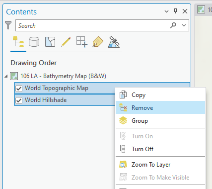
- From your previous map, copy the outline and contour layers and paste them into your new map (this way you don’t need to navigate to the source and re-apply symbology)
  - You can easily navigate from one map to another using the tabs above the map area
  - 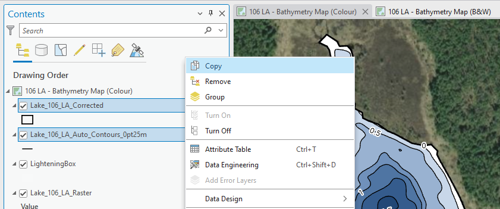
  - 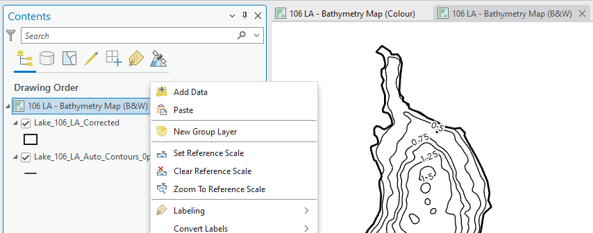

## 5.3 – Colour Layout

**Create the Layout**

- Copy and paste the template layout “### AA - Bathymetry Map (Colour) Template” in the catalog pane
  - 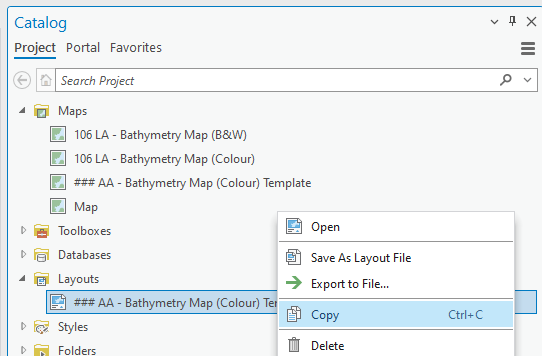
- Rename the layout to **"106 LA - Bathymetry Map (Colour)"**” (or whatever lake you are currently working on, but following this same format)
- Open the new colour layout created (double click)

**Swap the layout map from the template map to the new map**
- In the layout (e.g., “106 LA - Bathymetry Map (Colour)”), select the map frame, right click \> Properties
- A Map Frame “Elements” panel will pop open on the left
- Under the Map Frame section, for Map, use the dropdown to choose the proper map for the lake in question
  - 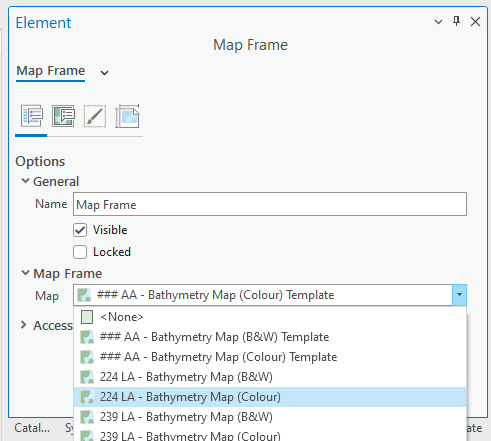
- The map may not be zoomed to the extent of the lake. Right click the outline (or any of the lake-specific layers) \> Zoom to Layer
  - On the left contents panel, expand the “Map Frame” (little left triangle) and then the map itself if needed, to see the map layers
  - 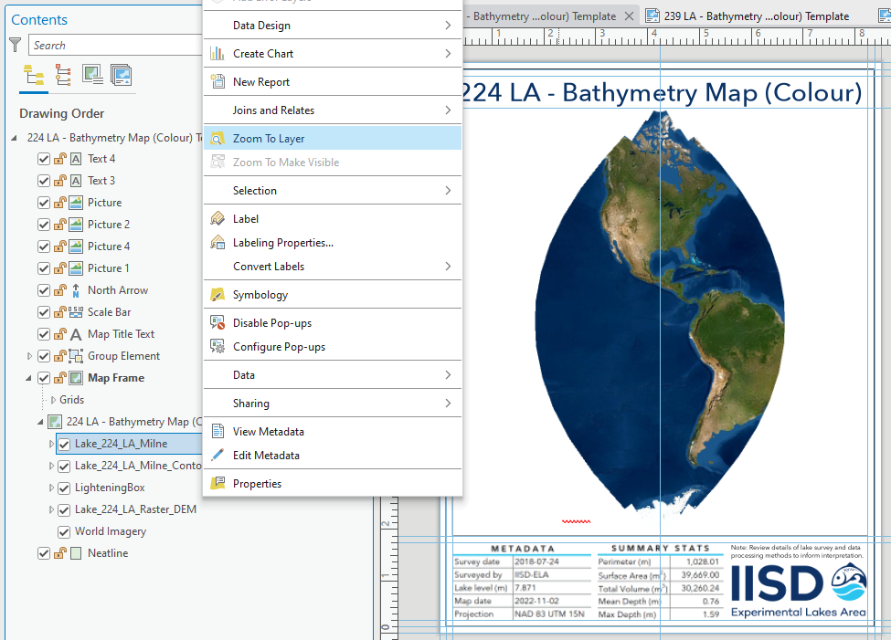
- The map title, scale bar, and north arrow should have automatically updated to be associated with this map
- Set up a good extent:
  - To work within the map frame of the layout, in the Contents panel right click the Map Frame \> Activate
    - 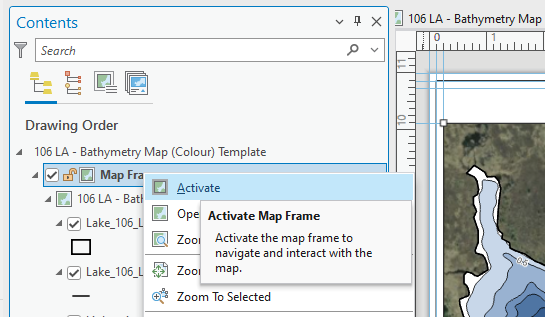
    - The upper menu ribbon and view of the layout will change to emphasize the map frame area (the rest of the layout is greyed out)
    - Use the Explore tool to pan (click drag) and zoom (mouse wheel, or left mouse drag) until the lake area is centered and takes up most of the map space.
      - 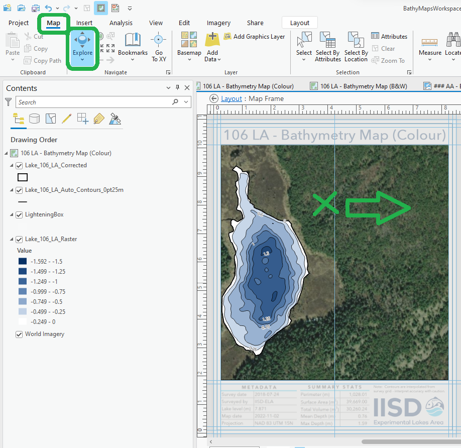

  - Rotate the map up to +/- 90 degrees if it allows for the lake to fill up more of the map space.
    - In the Contents panel, right click the map (106 LA – Bathymetry Map (Colour)) \> Properties
    - Under General \> Rotation type in an angle that allows the lake to better fill the map frame. Note that negative values rotate clockwise while positive values rotate counterclockwise (counterintuitive). Click OK. Try multiple times if needed, until a good angle is chosen, but do not rotate more than +/- 90 degrees as a rule.
      - 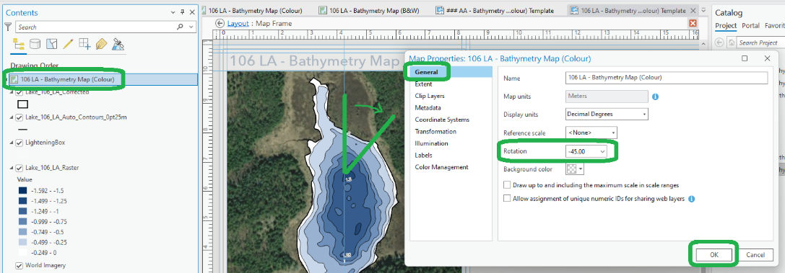

  - Adjust the extent, zooming in or out, so there is some World Imagery context surrounding the lake and the lake is well centered.
  - Round the scale to the nearest 100, 250, or 1000.
    - The scale is in a box at the bottom left of the layout area. Type in a new number and press Enter. Assess if the lake extent is still suitable or further adjustment is needed. In this example, the scale will be changed from 1,760 to 1,750.
      - 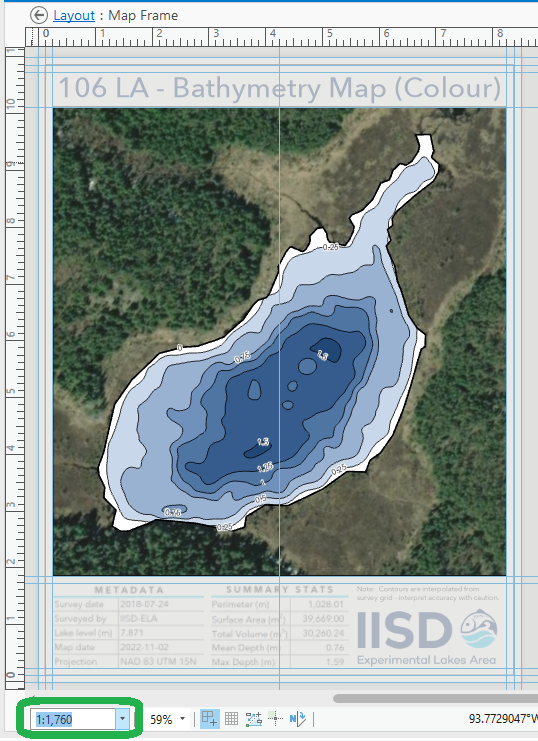
    - Exit Map editing mode (close the activated map frame) and return to the Layout mode.
      - In the top ribbon: Layout \> Close Activation
        - 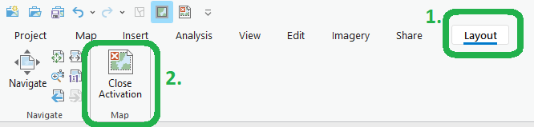

  - If needed, move the map title so it is centered at the top.
  - If needed, move the scale bar and north arrow so they are aesthetically placed near the bottom of the map area but do not overlap with the lake.
  - Adjust the scale bar width and divisions so the scale bar fits on the map and portrays easy-to-understand divisions (e.g., 0, 50, 100) – each map will be different and require some trial and error to find what works.
    - 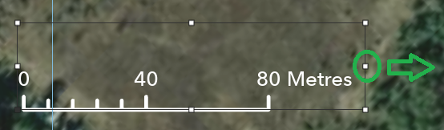
    - 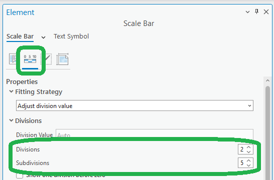

  - Contour interval text: update the interval from the template to reflect the contour interval used for the lake in question (usually “1 metre”, but some shallow lakes use finer scale contours). The text should remain in line with the scale bar and north arrow, left justified with a margin of space from the map corner. Use the spelling “metre(s)” not “meter(s)”.
    - 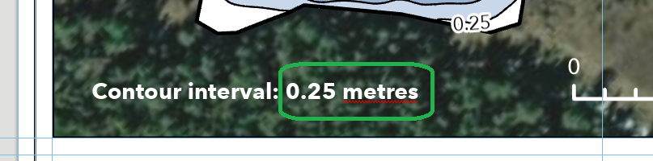

**Tables on the map**
**Use the Excel templates to fill in the data**
- There is a workspace set up in the maps project on SharePoint. If you are not working in a local synced shortcut folder, feel free to download the “TablesForMaps” folder and work locally, but be sure to upload any new files you produce when you are done!
  - SharePoint \> ELA \> Bathymetry\Workspaces\BathyMapsWorkspace\TablesForMaps
- Under the “ExcelTables” folder, copy the Template.xlsx file and rename the copy to your lake in question (using the standard naming format – e.g., 106_LA.xlsx).
- Open your renamed copy and fill in the data to the metadata and summary stats tables (there are two sheets in the one workbench file)
  - The reference data are exported from the Postgres Master Database and are found in the ReferenceDataMetadata folder
    - SharePoint \> ELA \> Bathymetry\Workspaces\BathyMapsWorkspace\TablesForMaps\ReferenceDataMetadata
  - This step requires extra care to ensure the *correct* values are transferred over (copy and paste or re-type manually)
  - Make sure that the formatting remains the same as the template (Font: Avenir Next LT Pro; Size: 11) – paste values (without formatting) may be useful here.
  - “Projection” will always be the same (hence why this is already filled in for the template)
  - “Map date” is the current date of this table being created and the map produced
  - “Surveyed by” will usually be IISD-ELA (instead of an individual staff member’s name). Exceptions are when the lake was surveyed by an external partner or contractor (e.g., Milne Technologies)
  - Request updated reference data, if needed, and confirm any uncertainties with the Scientific Data Officer (Chris Hay)
- Auto-fit the column width for the widest entry in the column
  - To do this, double click between the two column headers
  - 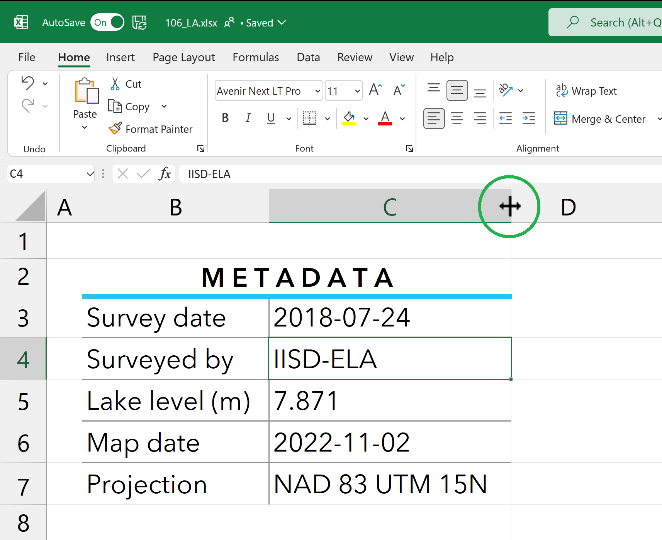
  - The column width should stay about the same (abbreviate long values if ever needed – e.g., future “Surveyed by” organizations or individuals)
- Save

**Convert to images**
- There is no quick and easy way to get a high quality copy of the table
- Ensure the Excel file is zoomed to 400%. This is indicated at the bottom right of the opened spreadsheet.
  - Adjust zoom by dragging on the zoom bar at the bottom right, or hold ctrl and use the mouse scroll wheel.
  - 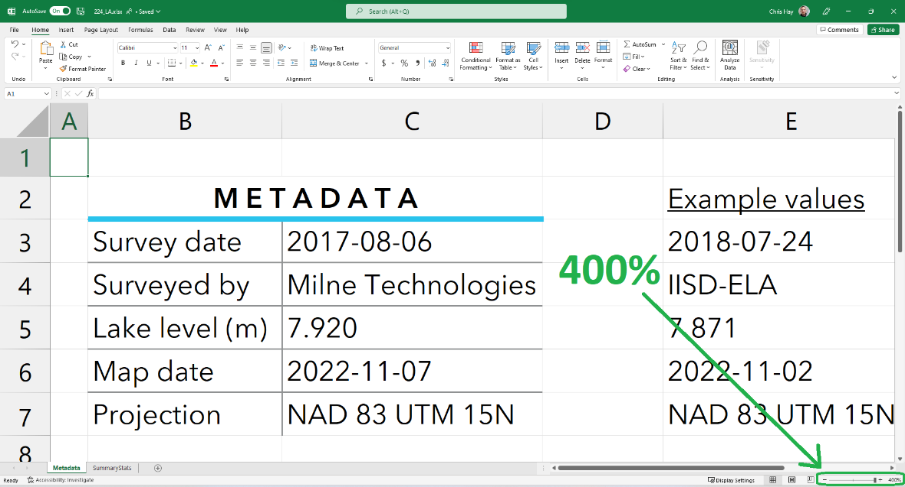

- **Note: Adjust borders if needed** – this section may not be required (keep reading). Screen resolutions and Windows display settings will influence the thickness of the borders. This will vary from computer to computer and screen to screen (e.g., laptop vs. secondary monitor). If using multiple monitors, drag to the monitor that is closer to the correct border thickness.*

  - *Use the screenshot below as a template to hold up aside the table and assess if the line thicknesses fit well enough (may need to zoom in or out or scale the example below until it is the same size as the Excel table on screen)*
    - 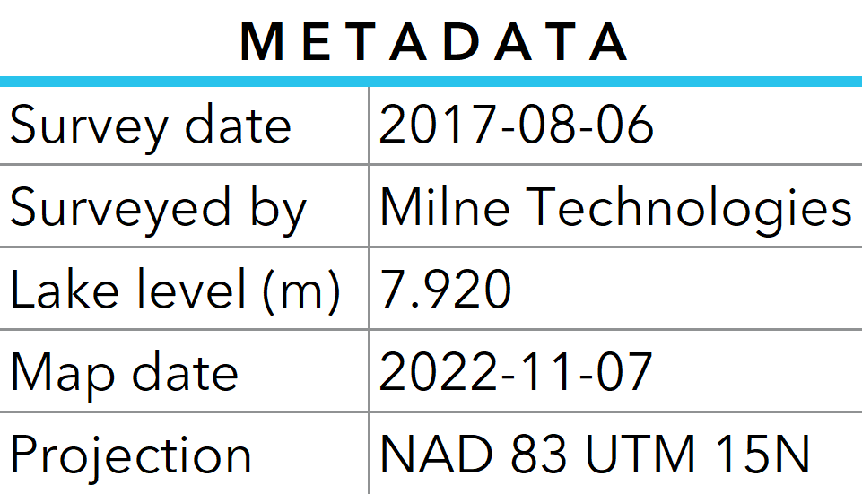
  - *For the grey internal borders, use the “Draw Borders” tool and options to choose an appropriate thickness and draw the borders.*
    - 
  - *For the grey internal borders, the colour should be a specific dark grey as specified in the IISD style guide: hex code \#909293 or \#8F9192. This can be specified under Draw Border \> Line Color \> More Colors… \> Custom (tab) \> Hex: \#909293 \> OK*
    - 
  - *For the light blue line under the table title, this is not a border but a line shape inserted on top of the table itself in Excel. Border settings do not allow for a line thick enough, so this is why a line shape was inserted instead.*
    - *The line colour should be hex \#29c3ec (should not need to check, change, or set this, given template)*
    - *To adjust thickness, click the line to select it, then right click \> Format Shape…, then a panel will pop up on the right side, where Width can be adjusted*
      - 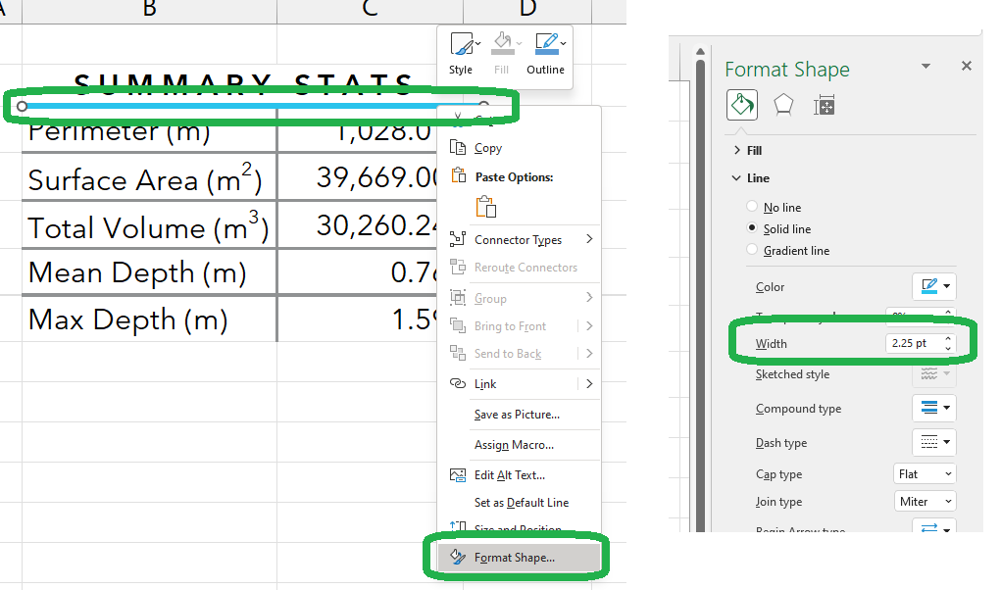

- Use the Snipping Tool app to snip out just the table extent. Find the snipping tool by using Windows search, or use the keyboard shortcut Windows Key + Shift + S. Drag over the table area to copy it to the clipboard. Do not worry about being too precise on the edges. The goal is to avoid the grey outer gridlines without cutting off too much of the internal lines. The snip can be cropped later.
  - 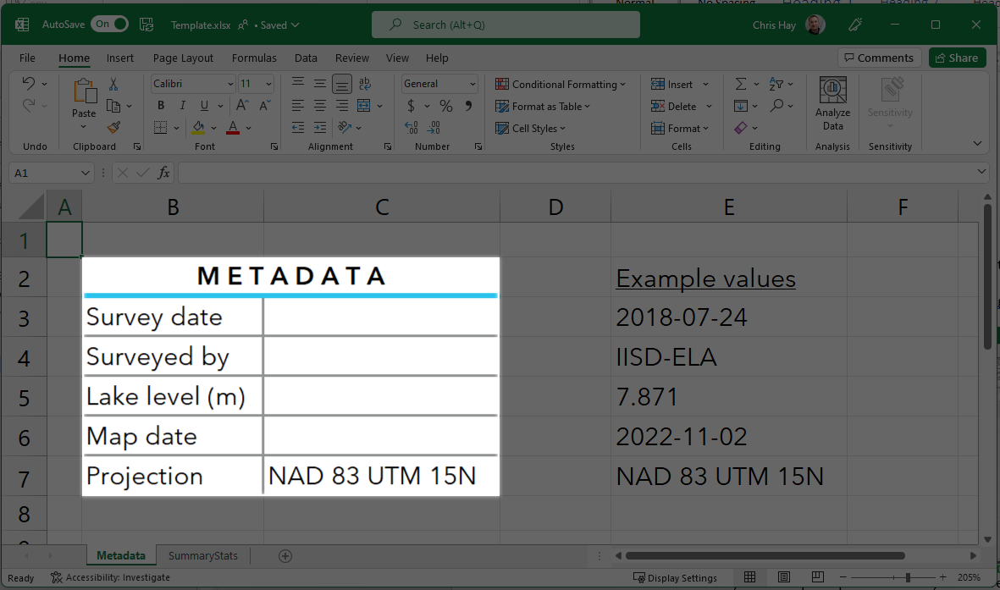

- Open the MS Paint app and paste in the snipped table (Ctrl + V). If preferred, the snip can be cropped and saved directly from the snip. But the image will need to be copied into paint later anyway, for the step of saving as a black and white version.

- Adjust the table to remove grey gridline edges that may have made it into the snip. Do not adjust the scale of the table, but use the select rectangle and crop tool. It is helpful to first zoom in while in Paint, to better eyeball the exact extent to clip. Zoom in so the table fills the paint view, but not further (otherwise it is impossible to draw the clipping extent to all corners). Undo (Ctrl + Z) and try again as needed.
  - 

- Save the image as PNG (File \> Save As \> PNG picture). Each table for each lake should be stored in the “ImageExports” folder in the workspace, for long term storage and re-use if needed. Follow the established naming convention (e.g., “106_LA_Metadata_Colour.png”, “106_LA_SummaryStats_Colour.png”)
  - SharePoint \> ELA \> Bathymetry\Workspaces\BathyMapsWorkspace\TablesForMaps\ImageExports

**Create Black and White version of the table**

Note: The below instructions worked in MS Paint in Windows 10, but this option was removed in Windows 11. If you are using Windows 11, you will have to find another way to convert the image to black and white. One option is to use this website: [https://blackandwhite.imageonline.co/](https://blackandwhite.imageonline.co/). Another option is to use photo editing software and change saturation to zero (e.g. the free [GNU Image Manipulation Program](https://www.gimp.org/).)

- Make Black and White versions at this stage – much faster than going back to do later.
  - After saving the colour version, click File \> Image Properties
    - 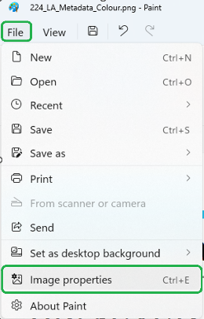
  - Under “Colours” choose “Black and White”, then click OK
    - 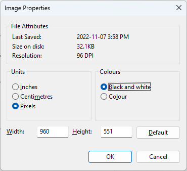
  - For the warning pop-up click OK (we will Save As, so the colour version will remain unaffected)
  - Save the Black and White version
    - File \> Save As \> PNG Picture \> in the same folder as the colour ones, but name \*\_B&W instead of \*\_Colour
- These steps will have to be done for both tables (metadata and summary stats)

**Insert the table images into the ArcGIS Pro map**
- Delete the template table images from the map, to avoid potential mixups with the new tables that will be inserted.
- With the working map layout in question, insert each image using the insert graphic tool.
  - Insert (top ribbon) \> Picture (picture icon in the box under the Graphics and Text section)
    - 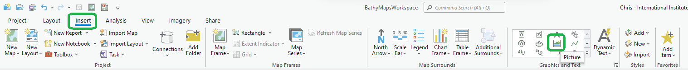
    - Navigate to where the table images were saved.
    - Double click anywhere around the bottom section of the layout to insert the table at its actual size (instead of click-dragging)
    - Do not adjust the size of the table image – first insert the other table image
  - Once both table images have been inserted, scale both at the same time (best to scale both at the same time so they remain in equal scale to one another)
    - Hold Ctrl or Shift to click select both
    - Drag the corner of one image inward to scale to the correct size – they should be sized to approximately fit within the guide lines in place on the layout.
    - 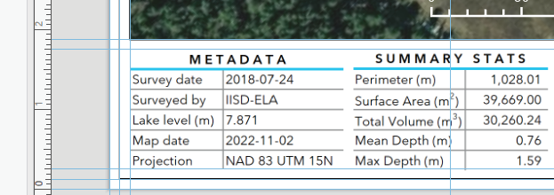
    - Once sizing and moving the images to the approximate correct places, zoom in close and move the tables at a finer scale. Click the image to select it, then hold Ctrl and tap the arrow keys to move the image in small increments. The “j” in “Projection” and “p” in “Max Depth” should just about touch the bottom guide line. The grey and blue table border lines should line up between the two tables (if they are offset, the map will look messy).
  - Save

**Bonus: Convert contour labels to annotation and manually improve aesthetics**
- Make sure the map extent and scale are set before running this step
- Right click contour layer in contents pane \> Convert Labels \> Convert Labels to Annotation
- Store the annotation feature class in the BathyMapsWorkspace.gdb for long term storage. You can drag the gdb from the Catalogue pane into the text box for “Output Geodatabase” or otherwise paste/type in the gdb folder path location. The defaults for the tool’s other parameters should be fine.
  - 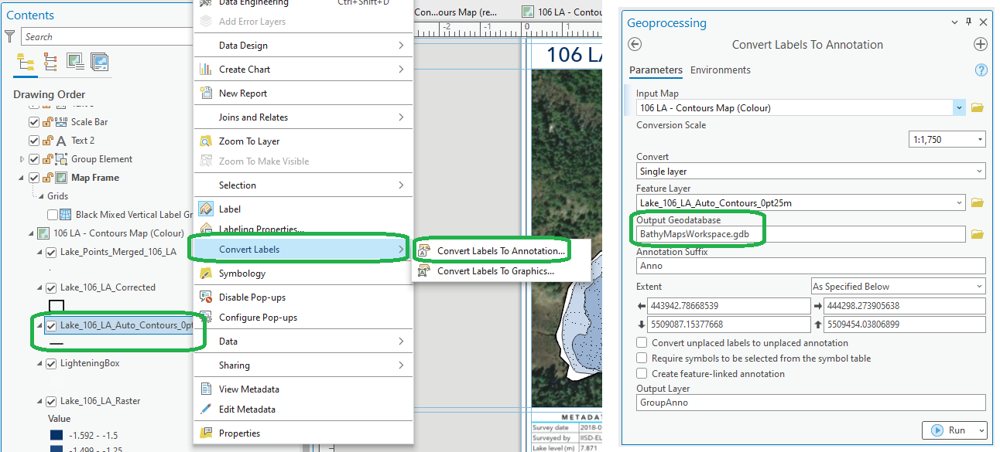
- Make the annotations layer the only selectable layer and move, delete, copy, and rotate annotations as needed. Here are some guidelines:
  - Aim for “step” style (contour labels on top of each other in a line) to some degree, when possible.
    - Here is a pretty good example: 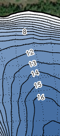
  - Rotate labels so they are in line with the contour line, but never place contour lables on parts of lines that are \>30 degrees away from horizontal (avoid the map-reader having to tilt their head to read them).
    - This label is too tilted: 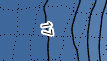
  - Remove labels from areas of dense contour lines, where it is unclear which line the label applies to.
    - Avoid this: 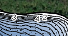
  - Save edits and deselect all
  - Save the map / project

## 5.4 – Black and White Layout

Basically, follow the same steps as for the colour layout.

**Create the Layout**
- Copy and paste the template layout and rename it

**Swap the layout map from the template map to the new map**
- Remove the template map frame
- Insert the new map frame
- Adjust extent, scale, and rotation of map to match the colour version of the map
- Update contour interval text

**Insert B&W Tables on the Map**
- The black and white table image files should already have been created when the colour table image files were.
- Insert the using the same method as the colour photos.

## 5.5 – Export the Maps
- Export the colour map
  - With the colour layout (not map) open, on the top ribbon menu click Share \> Export Layout (under “Output” section)
    - 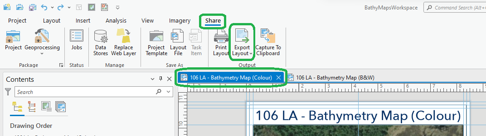

  - An “Export Layout” pane will open on the right. Ensure the save location is the maps export folder (SharePoint \> ELA \> Bathymetry\Data\Maps\Current\IISD-ELA\\, the file is named in the format “106 LA - Bathymetry Map (Colour).pdf”, and other parameters are set as below.
    - Under the main Properties tab:
    - 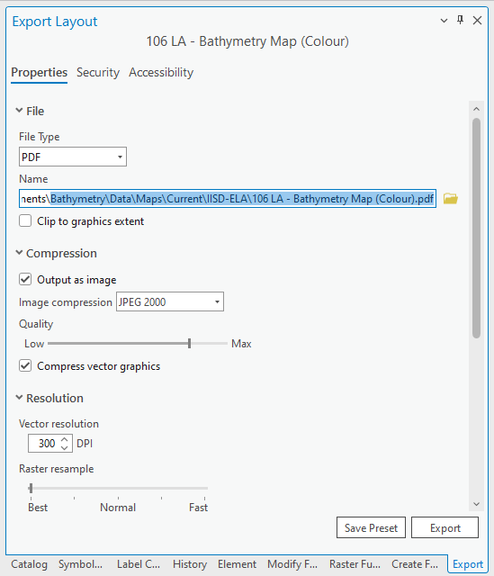
    - Scroll down…
    - 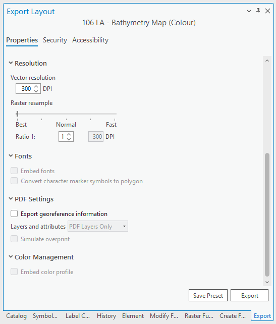
    - Under the Accessibility tab: make sure the metadata are updated to reflect the current lake and colour (not black and white)
    - 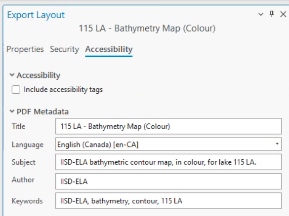
    - The defaults for the Security tab should be fine (do not set a password or other restrictions)
  - Click “Export”
- Check the exported PDF
  - Open the PDF file that was exported
  - Look at the PDF in full extent view, then zoom in and pan across to check nothing is overlapping or out of line
  - If needed, make changes to the map and re-export over the previous version (be sure to close the PDF first – the file cannot be overwritten if it is open, due to a system use lock)
- Repeat all of the above for the Black and White map
  - Do not forget to update the Accessibility \> PDF Metadata as needed (replace “Colour” with “B&W” in the Title, and in the Subject replace “in colour” with “in black and white”)
  - 
  - Do a final check on the black and white version as well